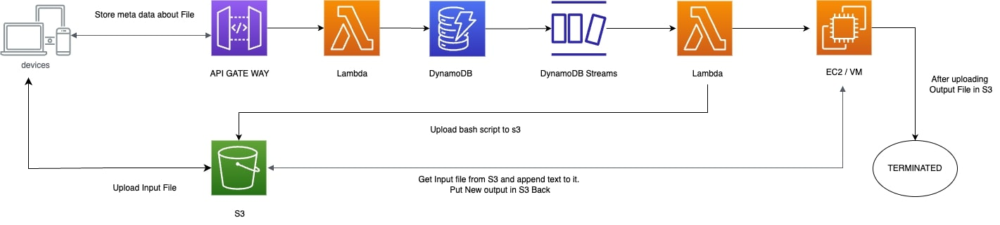

# AWS SERVERLESS PROJECT 

## BACKEND SETUP 

**CREATING IAM USER**

1. Create an `IAM User` in AWS Console.

2. Create Group with `Admin` and attach `FullAdministratorAccess` Policy to it.

3. Add created IAM User (In Step-1) to the `Admin` Group.

4. Generate Access Keys for IAM User from AWS Console.


**CREATING S3 BUCKET**

1. Create S3 Bucket in AWS Console (Region : `us-east-2` and BucketName: `reactappstorage`)

2. Allow Public Access while creating (Uncheck this option `Block Public Access settings for this bucket` )

3. Add Bucket Policy script in AWS Console (S3 permission for `reactappstorage` bucket) from `backend/s3/Bucket_poilicy.json`. It makes bucket public accessible.

4. Add Cross-origin resource sharing (CORS) script in AWS Console (S3 permission for `reactappstorage` bucket) from `backend/S3/Cross_origin_resource_sharing.json`


**CREATING AMI**

1. Create AMI Which is used as a reference to create EC2 Instance Dynamically from `TriggerVM` Lambda Function (Trigger for DynamoDB Insert operation)

2. Create a Security Group to allow `SSH` on EC2 Instance

3. Create a Policy with name `BATCH_JOB_POLICY`, Role with name `BATCH_IAM_ROLE` 

3.  Attach `BATCH_JOB_POLICY` to `BATCH_IAM_ROLE`


**CREATING LAMBDA FUNCTIONS**

1. Create Two Lambda Functions with names `StoreMetaRestAPI` and `TriggerVM` (Region: `us-east-2`)

2. `StoreMetaRestAPI` is connected with API-GATE-WAY for processing incoming request (To store s3 file meta data in DynamoDB)

3. Create a Policy with name `REST_API_POLICY`, Role with name `REST_API_ROLE` 

4. Attach `REST_API_POLICY` to `REST_API_ROLE`  and then attach `REST_API_ROLE` to `StoreMetaRestAPI` Lambda Function (for permission)

5. `TriggerVM` is Connected with DynamoDB streams to start VM (EC2 instance) on insert operation.

6. Create a Policy with name `STREAM_LAMBDA_POLICY` , Role with name `STREAM_LAMBDA_ROLE`

7. Attach `STREAM_LAMBDA_POLICY` to `STREAM_LAMBDA_ROLE`  and then attach `STREAM_LAMBDA_ROLE` to `TriggerVM` Lambda Function (for permission)

8. Add Respective environments for two Lambda Functions (`StoreMetaRestAPI` and `TriggerVM`).


**CREATING DYNAMODB TABLE**

1. Create DynamoDB Table with table name : `react_app_meta`.

2. Enable DynamoDB Streams and set `TriggerVM` Lambda function as triggger for it.

**CREATING API GATEWAY**

1. Create API-GATE-WAY with `rest-api` and enable Cross-origin resource sharing (CORS)

2. Create POST method and associate `StoreMetaRestAPI` as handler for it.


## FRONTEND SETUP 

**TO RUN FRONTEND LOCALLY**
```
// To Install dependencies
npm install 

// To Start Development Server
npm start

```


**A Video Demo is present in `Output.mov` file.**


## ARCHITECTURE OF PROJECT 





